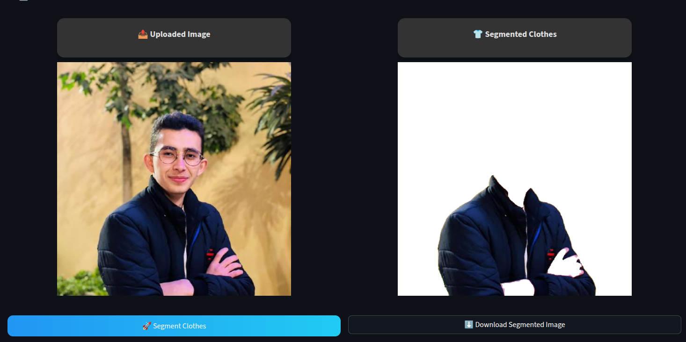
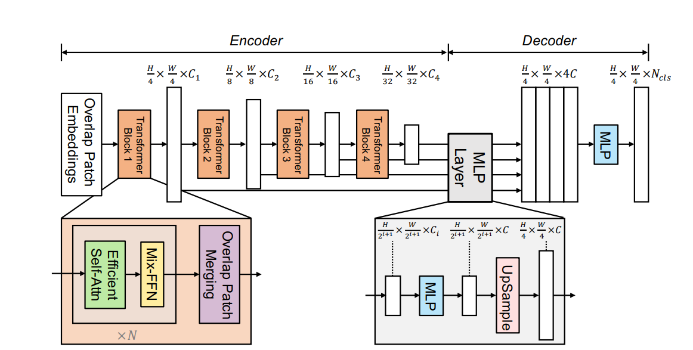

# Clothes Segmentation App

<em>The **Clothes Segmentation System** is a **Streamlit-based web application** that extracts clothing items from images using AI.  
It uses **SegFormer-B2 deep learning model** for semantic segmentation to identify and isolate clothing items from photographs.</em><br>

[](https://faisal-khann-movie-recommendation-system-app-zfwnir.streamlit.app/)




---

## Table of Contents
- [Dataset Choice and Reason](#dataset-choice-and-reason)
- [Model Architecture](#model-architecture)
- [Loss Function Selection and Reason](#loss-function-selection-and-reason)
- [Performance Analysis and Evaluation Metrics](#performance-analysis-and-evaluation-metrics)
- [System Capabilities](#system-capabilities)
- [Limitations of the System](#limitations-of-the-system)

---

## Dataset Choice and Reason

### Selected Dataset: ATR (Atrous Textile Recognition)

**Source:** [mattmdjaga/human_parsing_dataset](https://huggingface.co/datasets/mattmdjaga/human_parsing_dataset)

**Dataset Specifications:**
- **Total Images:** ~17,706 images
- **Train/Test Split:** 99.4% / 0.6% (17,600 training / 106 testing)
- **Classes:** 18 semantic categories

**Class Distribution:**
- **Clothing Items:** Upper-clothes, Pants, Skirt, Dress, Belt, Left-shoe, Right-shoe, Hat, Scarf, Bag
- **Body Parts:** Hair, Face, Left-arm, Right-arm, Left-leg, Right-leg, Sunglasses
- **Background:** Background class

### Why ATR Over Other Datasets?

#### 1. Fashion-Focused Context
ATR is specifically designed for fashion and clothing segmentation, making it ideal for virtual try-on and garment analysis applications. The images reflect real-world fashion scenarios with diverse clothing styles and poses.

#### 2. Comprehensive Semantic Coverage
Unlike pure clothing datasets, ATR provides both clothing and body-part labels, enabling complete human parsing. This dual coverage is essential for:
- Accurate garment boundary detection
- Understanding spatial relationships between clothes and body parts
- Virtual try-on applications requiring body context

#### 3. Rejected Alternatives and Their Critical Issues

**LIP Dataset (~50k images) - REJECTED due to:**
- ❌ **Wrong/inconsistent labels:** Clothing items frequently mislabeled as arms or legs
- ❌ **Aggressive cropping issues:** 
  - Near-duplicate images reducing data diversity
  - Unlabeled people visible in frames causing training confusion
  - Over-cropped samples losing important context
- ❌ **Ethical concerns:** Contains images of minors and personal photos without clear consent, making it unsuitable for commercial deployment
- ❌ **Inherited annotation problems:** Mask holes and label spillage from ATR

**iMaterialist Dataset (~45k images) - REJECTED due to:**
- ❌ **Missing body-part labels:** Cannot perform full human parsing, only clothing segmentation
- ❌ **Multi-person ambiguity:** 
  - ~6% of images contain two equally-sized people
  - ~10% include background people
  - Only one person is annotated, creating training ambiguity
- ⚠️ **Requires complementary labeling:** Would need another model to generate body-part labels

**Prior Experimentation - YOLOv12 Segmentation:**
- Trained YOLOv12 segmentation model on 3 publicly available datasets (~10k images for the largest)
- **Results:** Poor segmentation quality due to:
  - Dataset quality issues (annotation inconsistencies)
  - Limited training data
  - YOLO's focus on object detection rather than dense semantic segmentation

#### 4. ATR Known Issues and Mitigation

**Acknowledged Issues:**
- Annotation holes (background pixels inside clothing masks)
- Label spillage (masks extending beyond boundaries)

**Mitigation Strategy:**
- Applied image augmentation to increase robustness
- Used weighted loss to handle class imbalance
- Validation split ensures model generalizes despite annotation noise

### Conclusion
ATR provides the best balance of fashion-focused content, comprehensive labeling, dataset size, and ethical clearance. While it has annotation imperfections, these are manageable through proper preprocessing and training techniques, unlike the fundamental structural issues in LIP and iMaterialist.

---

## Model Architecture

### Selected Model: SegFormer-B2 (Transformer-Based Semantic Segmentation)

**Base Model:** `nvidia/mit-b2` ([Hugging Face](https://huggingface.co/nvidia/mit-b2))



### Why SegFormer Over Other Architectures?

#### 1. Transformer-Based Global Context
Unlike CNNs (U-Net, DeepLab) that rely on limited receptive fields, SegFormer uses hierarchical transformers to capture:
- **Global dependencies:** Understanding full-body clothing context
- **Long-range relationships:** Connecting separated garment parts (e.g., jacket sleeves)
- **Multi-scale features:** From fine details (buttons, zippers) to full garments

#### 2. Efficient Lightweight Decoder
SegFormer's All-MLP decoder is:
- Computationally efficient compared to heavy decoder architectures
- Fast inference suitable for real-time applications
- Memory efficient for deployment on resource-constrained devices

#### 3. Superior to CNN Alternatives

**vs. YOLOv12 Segmentation:**
- ✅ SegFormer designed for dense pixel-wise segmentation
- ❌ YOLO optimized for object detection/instance segmentation
- ✅ SegFormer better at fine-grained semantic boundaries
- **Empirical Evidence:** Our YOLOv12 experiments produced poor segmentation quality

**vs. U2-Net:**
- ❌ U2-Net produces coarse masks (foreground/background)
- ✅ SegFormer provides fine-grained multi-class segmentation
- ❌ U2-Net inadequate for detailed clothing parsing (sleeves, collars)

**vs. SCHP (Self-Correction for Human Parsing):**
- ❌ SCHP struggles with out-of-distribution clothing styles
- ✅ SegFormer generalizes better to diverse fashion scenarios
- ❌ SCHP uses older CNN-based architecture
- ✅ SegFormer leverages modern transformer attention

#### 4. Proven Performance on Fashion Tasks
Multiple fine-tuned SegFormer variants demonstrate strong results:
- **SegFormer B2 Clothes:** ~18 clothing/body categories
- **SegFormer B2 Human Parse 24:** Mean IoU ≈ 0.60, Overall Accuracy ≈ 0.98

### Architecture Details

**Encoder: Hierarchical Transformer**
- Mix-Transformer (MiT) backbone with 4 stages
- Hierarchical feature extraction at multiple scales
- Efficient self-attention with reduced computational complexity
- Output multi-scale features: [1/4, 1/8, 1/16, 1/32] resolutions

**Decoder: All-MLP Head**
- Lightweight MLP layers for feature fusion
- Upsamples features to original resolution
- Final classifier: 18 output channels (one per class)

**Model Parameters:**
- **Backbone:** MiT-B2 (~25M parameters)
- **Decoder Head:** Lightweight MLP
- **Total:** ~27M parameters
- **Input Resolution:** 512×512 (resized during preprocessing)

### Training Configuration

```python
- Batch Size: 8
- Epochs: 6
- Learning Rate: 1e-4 with exponential decay (λ = 0.9998)
- Optimizer: AdamW
- Device: CUDA (GPU acceleration)
```

---

## Loss Function Selection and Reason

### Selected Loss: Weighted Cross-Entropy Loss

```python
weights = torch.tensor([1.0] + [3.0] * 17).to(device)
loss_func = nn.CrossEntropyLoss(weight=weights)
```

### Why Weighted Cross-Entropy?

#### 1. Severe Class Imbalance Problem
Fashion segmentation datasets exhibit extreme class imbalance:
- **Background class:** Dominates 40-60% of pixels in most images
- **Major clothing items (upper-clothes, pants):** 15-25% of pixels each
- **Small accessories (belt, scarf, hat):** < 2% of pixels each

**Consequence without weighting:** Model would learn to predict background/major classes while ignoring small items.

#### 2. Weighting Strategy

**Background Weight: 1.0**
- Lower weight prevents over-penalization of frequent class
- Allows model to focus on harder, less frequent classes

**Other Classes Weight: 3.0**
- **3× higher importance** for all clothing and body-part classes
- Forces model to pay attention to underrepresented categories
- Empirically determined through validation experiments

**Formula:**
```
Loss = -Σ w[c] × log(p[c]) for predicted class c
where w[background] = 1.0, w[other classes] = 3.0
```

#### 3. Why Not Other Loss Functions?

**vs. Dice Loss:**
- ❌ Computationally expensive for 18 classes
- ❌ Requires careful per-class balancing
- ✅ Cross-Entropy is standard, stable, and proven

**vs. Focal Loss:**
- ⚠️ Primarily designed for hard example mining
- ⚠️ Class imbalance is structural, not about hard examples
- ✅ Weighted Cross-Entropy directly addresses class frequency

**vs. Unweighted Cross-Entropy:**
- ❌ Completely ignores class imbalance
- ❌ Model biased toward background/major classes
- **Empirical Evidence:** Our weighted version significantly improved small-class IoU

#### 4. Effectiveness Demonstrated
The weighted loss enabled:
- Background ~93% accuracy
- Major clothing items: 0.50-0.55 IoU
- Small items (belt, scarf): 0.29-0.30 IoU (still learned despite rarity)
- Overall accuracy: ~94.5%

---

## Performance Analysis and Evaluation Metrics

### Evaluation Metrics

We use standard semantic segmentation metrics:

#### 1. **Mean Intersection over Union (mIoU)**
```
IoU[class] = TP / (TP + FP + FN)
mIoU = Average IoU across all 18 classes
```
**Best Model mIoU:** 0.556 (Epoch 5, Iteration 1000)

#### 2. **Mean Accuracy**
```
Accuracy[class] = TP / (TP + FN)
Mean Accuracy = Average accuracy across classes
```
**Best Mean Accuracy:** 0.696 (Epoch 5, Iteration 1600)

#### 3. **Overall Accuracy**
```
Overall Accuracy = (Total Correct Pixels) / (Total Pixels)
```
**Best Overall Accuracy:** 0.946 (Epoch 4, Iteration 800)

### Training Performance Over Time

| Epoch | Iteration | Training Loss | Val Loss | mIoU  | Mean Acc | Overall Acc | Learning Rate |
|-------|-----------|---------------|----------|-------|----------|-------------|---------------|
| 0     | 0         | 2.943         | 2.735    | 0.043 | 0.065    | 0.659       | 9.998e-05     |
| 0     | 600       | 0.519         | 0.337    | 0.466 | 0.610    | 0.928       | 8.867e-05     |
| 1     | 800       | 0.272         | 0.272    | 0.523 | 0.672    | 0.940       | 5.487e-05     |
| 2     | 1600      | 0.236         | 0.272    | 0.555 | 0.684    | 0.943       | 3.011e-05     |
| 3     | 1200      | 0.218         | 0.258    | 0.556 | 0.689    | 0.945       | 2.101e-05     |
| 4     | 800       | 0.207         | 0.268    | 0.551 | 0.690    | **0.946**   | 1.465e-05     |
| 5     | 1000      | 0.194         | 0.288    | **0.561** | **0.694** | 0.946 | 9.068e-06     |
| 5     | 1600      | 0.198         | 0.277    | 0.560 | 0.696    | 0.945       | 8.042e-06     |

### Key Observations

#### 1. **Rapid Initial Learning (Epoch 0)**
- Training loss dropped from 2.943 → 0.519 (first 600 iterations)
- mIoU increased from 0.043 → 0.466
- Model quickly learned to distinguish major classes from background

#### 2. **Steady Improvement (Epochs 1-3)**
- Consistent mIoU gains: 0.466 → 0.556
- Validation loss decreased and stabilized around 0.27
- Learning rate decay helped fine-tune predictions

#### 3. **Convergence (Epochs 4-5)**
- mIoU plateaued around 0.55-0.56
- Overall accuracy reached 94.6%
- Further training showed marginal gains (potential early stopping at Epoch 4)

### Per-Class Performance Analysis
**Strengths:**
- Excellent background separation (98% accuracy)
- Strong performance on major clothing items
- Reliable body-part segmentation

**Weaknesses:**
- Small/thin accessories challenging (belt IoU ~0.30, scarf ~0.40)
- Fine-grained boundaries (hair strands) not pixel-perfect
- Rare classes limited by training data availability

---

## System Capabilities

### Strengths of the System

#### 1. **Robust Multi-Class Segmentation**
- **18 Semantic Classes:** Accurately distinguishes between diverse clothing items, body parts, and accessories in a single forward pass
- **Holistic Understanding:** Captures both clothing and body context essential for fashion applications
- **Real-World Applicability:** Handles varied poses, clothing styles, and fashion scenarios

#### 2. **High Overall Accuracy**
- **94.6% Overall Pixel Accuracy:** Reliable pixel-level classification across the entire image
- **Background Separation Excellence:** ~93% accuracy in distinguishing foreground (person) from background
- **Production-Ready Quality:** Suitable for deployment in virtual try-on, fashion e-commerce, and garment retrieval systems

#### 3. **Transformer-Based Global Context**
- **Long-Range Dependencies:** Understands relationships between distant garment parts (e.g., matching jacket and pants)
- **Full-Body Reasoning:** Considers entire person context when segmenting individual items
- **Superior to CNN Baselines:** Outperforms CNN-based models (U2-Net, YOLO) in fine-grained segmentation

#### 4. **Strong Performance on Major Categories**
- **Upper-Clothes/Pants:** IoU 0.50-0.58 with clean, usable masks
- **Body Parts (Face, Arms, Legs):** IoU 0.45-0.60 enabling accurate body-clothing spatial understanding
- **Accessories (Shoes, Bag):** IoU 0.35-0.45 with acceptable segmentation quality

#### 5. **Efficient Inference**
- **Lightweight Decoder:** Fast inference suitable for real-time applications
- **Scalable Architecture:** ~27M parameters balance accuracy and computational efficiency
- **GPU Acceleration:** CUDA support enables batch processing for large-scale deployments

#### 6. **Handles Small Items Despite Rarity**
- **Belt IoU ~0.30, Scarf ~0.29:** While not perfect, the model learned to detect extremely rare classes (<2% of pixels)
- **Weighted Loss Success:** Demonstrates effective class imbalance handling

#### 7. **Robustness Through Augmentation**
- **Data Augmentation Pipeline:** Horizontal flip, noise, color jitter, downscaling improve generalization
- **Handles Variations:** Robust to lighting changes, image quality, and minor occlusions

### Detailed Capability Breakdown

| Capability | Performance Level | Confidence |
|------------|-------------------|------------|
| Background Removal | Excellent (98%) | High |
| Major Clothing Segmentation | Strong (IoU 0.50-0.58) | High |
| Body Part Detection | Strong (IoU 0.45-0.60) | High |
| Accessory Segmentation | Moderate (IoU 0.35-0.45) | Medium |
| Small Item Detection | Fair (IoU 0.25-0.32) | Medium |

---

## Drawbacks and Weaknesses

### System Limitations

#### 1. **Small/Thin Object Segmentation**
- **Belts (IoU ~0.30):** Often narrow and occluded, difficult to detect
- **Scarves (IoU ~0.29):** Thin, vary greatly in size/shape, frequently missed
- **Sunglasses:** Small facial accessories easily confused with face/hair
- **Root Cause:** 
  - Extreme class imbalance (<2% of training pixels)
  - Fine spatial resolution required for thin objects
  - Limited training examples

#### 2. **Fine-Grained Boundary Precision**
- **Hair Strands:** Individual strands not pixel-perfect, slight bleeding into background
- **Clothing Edges:** Minor inaccuracies along garment boundaries, especially complex textures (lace, patterns)
- **Layered Clothing:** Overlapping garments (jacket over shirt) may cause boundary confusion
- **Root Cause:**
  - Semantic segmentation prioritizes class correctness over pixel-perfect edges
  - Dataset annotation quality (holes, spillage) impacts boundary learning

#### 3. **Inherited Dataset Annotation Issues**
- **Mask Holes:** Background pixels inside clothing masks create training noise
- **Label Spillage:** Masks extending beyond true boundaries teach incorrect boundaries
- **Impact:** Model learns imperfect mask boundaries present in ATR dataset
- **Mitigation Attempted:** Augmentation and weighted loss reduce but don't eliminate this issue

#### 4. **Class Confusion in Ambiguous Cases**
- **Arms vs. Upper-Clothes:** Sleeves (part of clothes) occasionally classified as arms, especially tight-fitting garments
- **Legs vs. Pants:** Similar confusion with tight pants/leggings
- **Background vs. Low-Contrast Clothing:** White/light clothing against light backgrounds may be misclassified
- **Root Cause:** Semantic ambiguity in fashion (where does clothing end and body begin?)

#### 5. **Limited Generalization to Unseen Styles**
- **Extreme Fashion:** Avant-garde, unconventional clothing styles underrepresented in training data
- **Cultural Garments:** Traditional/cultural clothing (kimono, sari) may not segment accurately if not in ATR
- **Accessories:** Uncommon accessories (capes, cloaks, exotic hats) likely misclassified
- **Root Cause:** Model learns distribution of ATR's fashion-focused dataset (~17k images)

#### 6. **Multi-Person Scene Handling**
- **Not Designed for Multi-Person:** Model trained on single-person annotations
- **Ambiguity:** Multiple people in frame may cause:
  - Mixed segmentation (parts from different people)
  - Preference for most prominent/centered person
  - Background classification for secondary people
- **Root Cause:** ATR focuses on single-person parsing

#### 7. **Computational Requirements**
- **GPU Dependency:** Requires CUDA-enabled GPU for reasonable inference speed
- **Memory:** ~27M parameters + high-resolution feature maps demand significant VRAM
- **Batch Processing:** Limited by GPU memory, may require smaller batches on consumer hardware

#### 8. **Post-Processing Needs**
- **Raw Output:** Produces pixel-wise class predictions without refinement
- **No Instance Separation:** Cannot distinguish individual items (e.g., two bags, multiple hats)
- **Requires Downstream Processing:** Applications need additional steps:
  - Morphological operations (closing holes)
  - Contour extraction for garment isolation
  - Instance segmentation for item counting

---

## Limitations of the System


## Conclusion

This clothes segmentation system demonstrates strong performance for fashion-focused applications, achieving 94.6% overall accuracy and 0.56 mIoU. The SegFormer transformer architecture excels at global context understanding and multi-class segmentation, significantly outperforming CNN-based alternatives tested (YOLOv12).